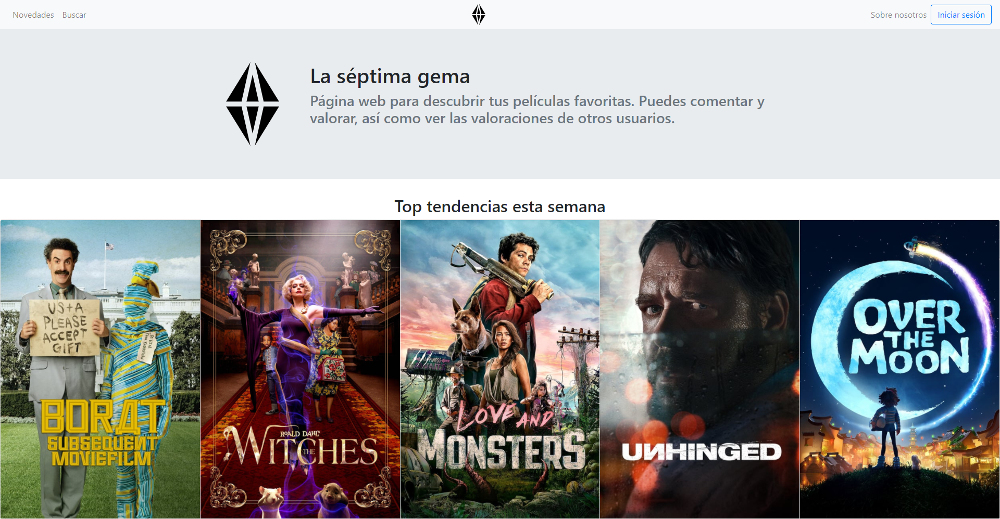
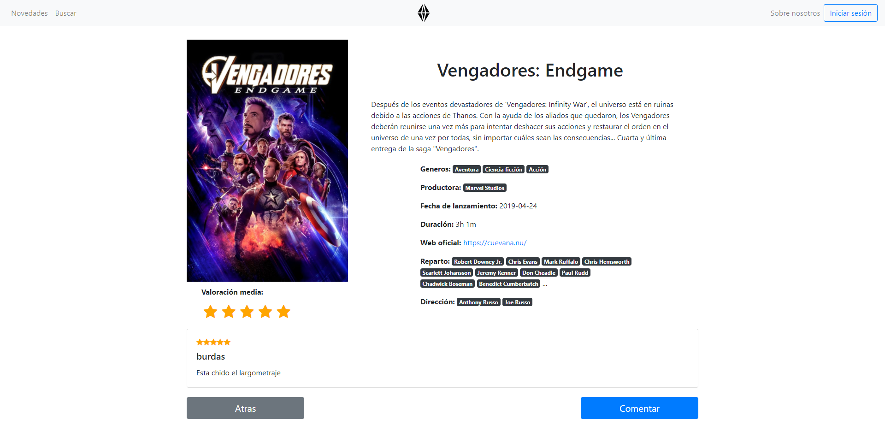

# La7aGema

Este es el reositorio de un proyecto realizado para la asignatura Ingeniería Web. Este fue en colaboración de dos compañeros más.

El proyecto es un sitio web en el cual aparecen un listado de peliculas. De ellas se puede observar su caratula, título, genero, actores y demás datos. Presenta un registro de usuarios los cuales pueden valorar estas películas y comentarlas.

Para el desarrollo del proyecto se han utilizado los siguiente recursos:

- Patrón modelo-vista-controlador (MVC)
- PHP
- MySql
- HTML5, CSS, JavaScript
- JQuery
- Bootstrap
- API datos peliculas [The Movie Database](https://developers.themoviedb.org/3/getting-started/introduction)

Memoria del proyecto: [Memoria](Memoria.pdf)

## Página principal de La Séptima Gema, Top tendencias:

## Página de una película de La Séptima Gema:

